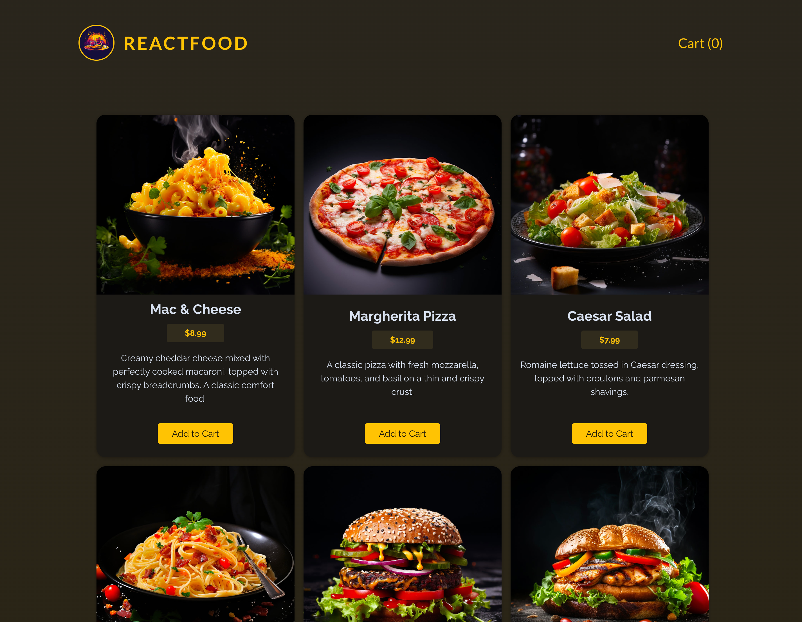

# 📝 FoodOrderApp

A simple project built as part of a Udemy course to practice React.

## 🚀 Features
- 🛒 Add & remove items from cart
- ✅ Checkout process
- 🍽️ Fetch meals from an API
- 🔄 Context API for state management

## 🛠️ Tech Stack
- React, Context API, useReducer, custom hooks, CSS.

## 🏗️ How to Run the Project

1. Clone the repository:
   ```bash
   git clone https://github.com/halynabondar/FoodOrderApp.git
   ```

2. Install dependencies:
   ```bash
   npm install
   ```

3.	Start the project:
   ```bash
   npm run dev
   ```

## Screenshots

